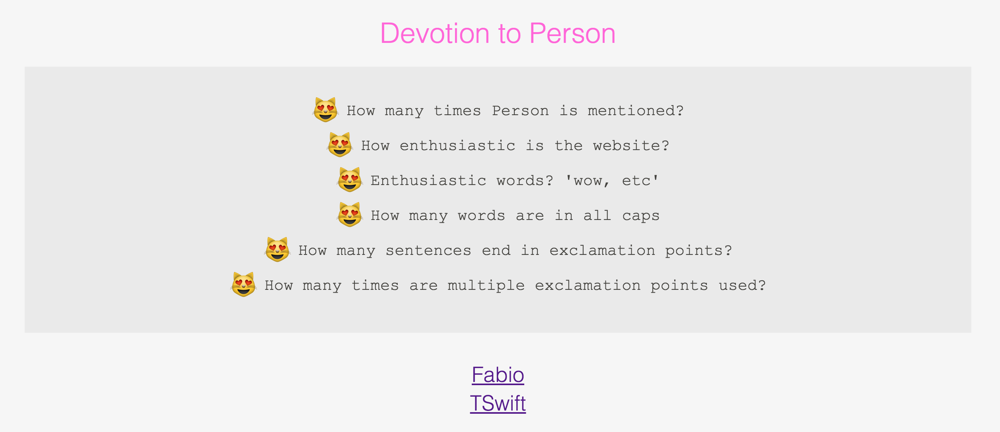
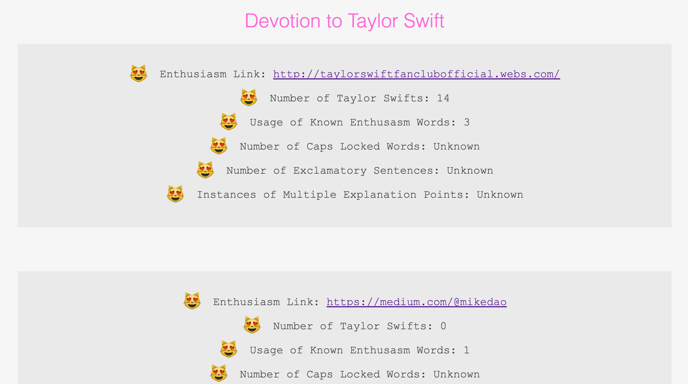

# Regex Practice - Devotion to Person

## Running the App

`bundle install`

`rails s`

## Running the tests

`bundle exec rake test`

This will run the tests. You'll find a series of model tests that are passing, and even more that are skipped and that you can try to get passing.

As you get the tests to pass, you'll see the results of your code show up in the app itself!

